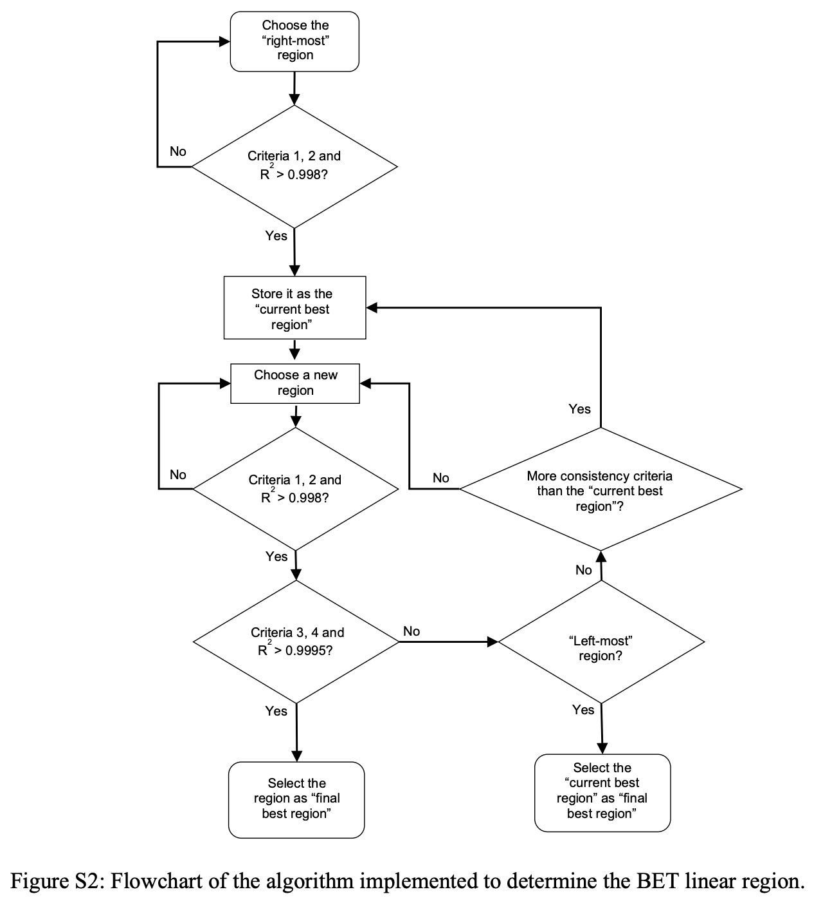

# Introduction
Forget about using an old excel spreadsheet from your co-workers! **On-the-fly**, the [SESAMI (Script to Estimate the Surface Area of Materials from their Isotherms) website](https://sesami-web.org/) performs Brunauer-Emmett-Teller (BET), BET+Excess Sorption Work (ESW), and Machine Learning (ML) methods for surface area
estimation in nanoporous materials. This website allows a user to upload either an [Adsorption Information File (AIF)](https://pubs.acs.org/doi/10.1021/acs.langmuir.1c00122) or a Comma Separated-Values (CSV) file. 

This website is based on the [MOFSimplify](https://github.com/hjkgrp/MOFSimplify) website developed by the [Kulik Group](http://hjkgrp.mit.edu/) at MIT.

For additional support, feedback, and inquiry, please raise a GitHub issue in this repo.

# Sample Output
For the downloadable figures generated on the website, a user can adjust the font type, font size, dot-per-inch (dpi), and legend to their liking.

# Website Configuration
The website is powered by `Mongo DB 5.3.1` and `Google Cloud Run`.

# Calculation Details
The SESAMI 1 algorithms employed in this code select the linear region from an isotherm and compute the surface area of the corresponding material. A detailed description of the algorithm can be found on page S5 of [J. Phys. Chem. C 2019, 123, 33, 20195 - 20209](https://pubs.acs.org/doi/abs/10.1021/acs.jpcc.9b02116). An excerpt from the SI is provided below for completeness.

## BET Areas (SESAMI 1)
We consider the “right-most” region, which is the region having a high-pressure limit at the point where the **first maximum of q(1 − p/p0) with respect to p/p0 occurs** (q is the loading, p is the vapor pressure, and p0 is the saturation vapor pressure), as per consistency **criterion 1**, and a low-pressure limit at the lowest pressure point on the isotherm. Next, we consider a region that has the same upper pressure limit but a lower pressure limit that is shifted to the right by one point on the pressure axis. We continue to move the lower pressure limit to the right **until we locate a region with 4 consecutive data points**. Then, we shift the upper pressure limit to a smaller value by one point, and again move the lower pressure limit to the right as before until we reach another 4-point linear region. The process continues until we reach **a 4-point region starting at the lowest pressure point on the isotherm**, which we define as the “left-most” region. We select a linear region to compute the BET area that satisfies as many consistency criteria as possible and contains at least 4 points. 

### Best Region for BET Area Calculation
To select the best region (i.e., the linear region that satisfies the most consistency criteria), we search through all possible “linear” regions.
Here, a **linear region is a set of 4+ consecutive points having an R2 value greater than 0.998**, and **fulfilling consistency criteria 1 and 2**. We start with the “right-most” region from the isotherm, and check if it is “linear.” If it is, we store it as the “current best region.” If not, we continue to consider subsequent regions until we find one that is “linear.” Then, we move on to other candidate regions at lower pressures. 

If a region is not “linear” as judged by R2, it is disregarded. If it is “linear” and satisfies criteria 1 and 2, **we check if it satisfies consistency criteria 3 and 4 and has an R2 > 0.9995**. The satisfaction of all these conditions indicates that the region is suitable for BET analysis. If all conditions are satisfied, we choose the current region as the “final best region” and the algorithm ends. If not, we check if the current region satisfies more consistency criteria than the “current best region.” If it does, we replace the “current best region” with the current region. This process is repeated until we reach the “left-most” region. At this point, we end the search by choosing the “current best region” as the “final best region.” The **final best region** is used to compute the **BET area for the structure**. See the function `picklen` in [betan.py](/SESAMI/SESAMI_1/betan.py).

<!-- ## ESW areas
The ESW area is computed from the loading at the first minima on the ESW plot.

We compute the slope at each point and identify the point where the slope changes sign from negative to positive to obtain the ESW minima. The slope at each point is the slope of a line fitted through 7 points; 3 before and 3 after the selected point. Even though using 7 points to compute the slopes in the SESAMI 1 study yielded satisfactory results, we still highly recommend that users visually inspect the choice of the first local minimum to ensure that it is reasonable. -->

## BET + ESW Areas (SESAMI 1)
The BET + ESW areas are computed in the same way as the BET areas except that the algorithm is forced to include the first (lowest loading) ESW minimum in the selected region. Thus, the chosen region **must satisfy** consistency criteria 1 and 2 and have an R2 > 0.998, and include the relative pressure corresponding to the first ESW minimum point. The correct calculation of the BET + ESW areas depends on the correct identification of the ESW minimum. If the ESW minimum is wrongly identified, the BET + ESW area will also be wrong. Thus, we recommend that users ensure that the first minimum is correctly identified. 

## ML Areas (SESAMI 2)
The machine learning areas are computed using a Lasso linear regression model that takes as input the mean loading values of seven logarithmically divided pressure subregions. The model is trained on GCMC-calculated argon isotherms at 87 K. For more information, see [Beyond the BET Analysis: The Surface Area Prediction of Nanoporous Materials Using a Machine Learning Method](https://pubs.acs.org/doi/abs/10.1021/acs.jpclett.0c01518) and [SESAMI_2.py](/SESAMI/SESAMI_2/SESAMI_2.py).

# Preparing Input Files
A user can provide an adsorption isotherm to the website as either an AIF file or a CSV file.

Use https://clownfish-app-lzoex.ondigitalocean.app/ to convert instrument output to AIF file ormat.
- Details on AIF file formatting can be found in [this repository](https://github.com/AIF-development-team/adsorptioninformationformat). The website https://adsorptioninformationformat.com/ will reflect changes as they occur.

For inputting isotherm data as a CSV file, see [this example](/example_input/example_loading_data.csv).

# Hosting Site on Your Computer
1. Make and activate a Conda environment using [environment.yml](environment.yml). 
2. Use the following command in the terminal to run:
`python app.py`
3. Upload `AIF` or `CSV` formatted data.
4. Click `Run calculation` and wait a few seconds.

Note, the front end of the website is [index.html](index.html) and the backend is [app.py](app.py). The backend makes use of routines in the folder [SESAMI](/SESAMI), which contains the SESAMI 1 and 2 code.

# References
- [Surface Area Determination of Porous Materials Using the Brunauer–Emmett–Teller (BET) Method: Limitations and Improvements](https://pubs.acs.org/doi/abs/10.1021/acs.jpcc.9b02116),
J. Phys. Chem. C 2019, 123, 33, 20195 - 20209
- [Beyond the BET Analysis: The Surface Area Prediction of Nanoporous Materials Using a Machine Learning Method](https://pubs.acs.org/doi/abs/10.1021/acs.jpclett.0c01518),
J. Phys. Chem. Lett. 2020, 11, 14, 5412 - 5417
- Reference for SESAMI web interface paper coming soon!

# Authors
- Gianmarco G. Terrones (SESAMI web interface development)
- Archit Datar (SESAMI python code development)
- Yongchul G. Chung (project supervision, Mongo DB Atlas and Google Cloud integration)

# JOSS Paper Supplementary Files
Files used for software performance benchmarking can be found [here](paper/benchmarking).

# Funding Acknowledgements
- Gianmarco G. Terrones was supported by the Government of Portugal through the Portuguese Foundation for International Cooperation in Science, Technology and Higher Education and through the MIT Portugal Program. 
- Software and website development was supported by the Office of Naval Research under grant number N00014-20-1-2150, as well as by the National Research Foundation of Korea (NRF) under grant number 2020R1C1C1010373 funded by the government of Korea (MSIT). 
- Gianmarco G. Terrones was partially supported by an Alfred P. Sloan Foundation Scholarship (Grant Number G-2020-14067). 
